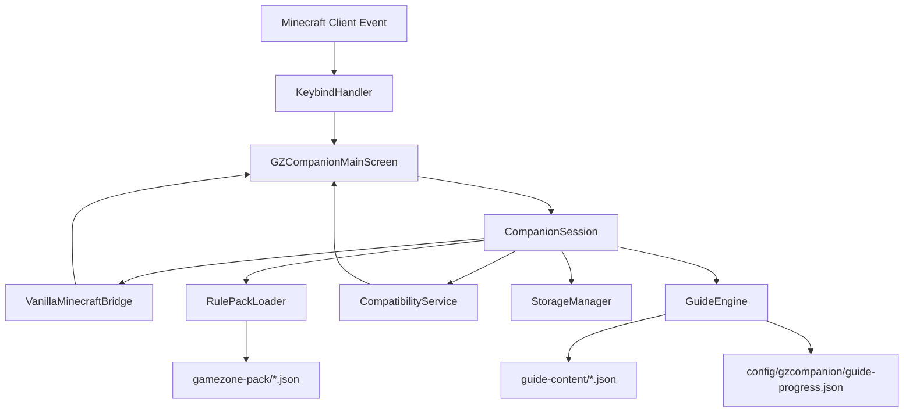

# GZ Companion Architecture Guide

## 1. High-Level Architectural Rule
> **"Java understands Minecraft. Data understands GameZone."**

The mod is architected to ensure that GameZone server mechanics, commands, recipes, and rules can evolve without requiring core mod rewrites or recompilations.

---

## 2. Layer & Package Separation

```
se.jimmyeliasson.gzcompanion
├── GZCompanionClient.java        # Fabric client entrypoint
├── core/
│   ├── CompanionConstants.java   # Mod metadata
│   ├── CompanionSession.java     # Runtime coordinator singleton
│   └── feature/                  # Data-driven feature flags
├── guide/
│   ├── GuideEngine.java          # Progression state & inference engine
│   ├── GuideLoader.java          # Resilient guide JSON parser
│   ├── GuideValidator.java       # Prerequisite cycle & schema validator
│   ├── bridge/                   # Player snapshot abstraction
│   ├── condition/                # Pure condition evaluators
│   ├── model/                    # Immutable guide definitions & records
│   └── progress/                 # Local progress storage & atomic file writes
├── minecraft/
│   ├── MinecraftBridge.java      # Runtime abstraction interface
│   └── VanillaMinecraftBridge.java # Minecraft client API caller
├── profile/
│   ├── ServerProfile.java        # Server identity models
│   └── ServerDetection.java      # Safe hostname resolution
├── gamezone/
│   ├── RulePack.java             # In-memory rule pack model
│   ├── RulePackManifest.java     # Version & verification metadata
│   ├── RulePackLoader.java       # Resilient JSON parser
│   └── model/                    # Commands, guides, world rules
├── diagnostics/
│   ├── CompatibilityStatus.java  # Semantic status codes & colors
│   ├── ModuleReport.java         # Per-module diagnostic record
│   ├── CompatibilityResult.java  # Overall evaluation
│   └── CompatibilityService.java # Dynamic compatibility evaluator
├── storage/
│   ├── CompanionConfig.java      # Local user preferences
│   └── StorageManager.java       # Local JSON persistence & backup
├── keybind/
│   └── KeybindHandler.java       # Fabric KeyMapping registration
└── ui/
    ├── GZTheme.java              # Color palette, tokens, card renderer
    ├── TabType.java              # 9 navigation section definitions
    ├── GZCompanionMainScreen.java# Main container dialog screen
    ├── layout/                   # Responsive geometry & typography
    └── tabs/
        ├── HomeTabComponent.java # Home dashboard
        ├── GuideTabComponent.java# Interactive 2-pane guide tab
        └── PlaceholderTabComponent.java # Placeholder sections
```

---

## 3. Data Flow



---

## 4. Graceful Degradation Strategy
- If a specific Rule Pack module fails to parse or is missing from classpath, `RulePackLoader` records a warning and instantiates an empty fallback collection for that module.
- `CompatibilityService` flags that individual module with `UNVERIFIED` or `WARNING`, while keeping the rest of the mod fully operational.
- The UI displays explicit status badges instead of failing silently or guessing server behavior.