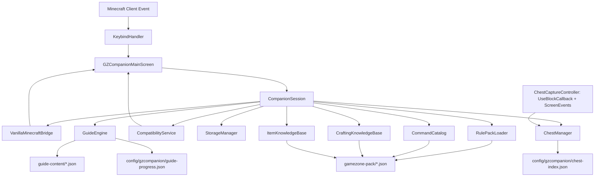

# GZ Companion Architecture Guide

## 1. High-Level Architectural Rule
> **"Java understands Minecraft. Data understands GameZone."**

The mod is architected to ensure that GameZone server mechanics, commands, recipes, and rules can evolve without requiring core mod rewrites or recompilations.

---

## 2. Layer & Package Separation

```
se.jimmyeliasson.gzcompanion
├── GZCompanionClient.java        # Fabric client entrypoint
├── core/
│   ├── CompanionConstants.java   # Mod metadata
│   ├── CompanionSession.java     # Runtime coordinator singleton
│   └── feature/                  # Data-driven feature flags
├── guide/
│   ├── GuideEngine.java          # Progression state & inference engine
│   ├── GuideLoader.java          # Resilient guide JSON parser
│   ├── GuideValidator.java       # Prerequisite cycle & schema validator
│   ├── bridge/                   # Player snapshot abstraction
│   ├── condition/                # Pure condition evaluators
│   ├── model/                    # Immutable guide definitions & records
│   └── progress/                 # Local progress storage & atomic file writes
├── chest/
│   ├── ChestManager.java         # "Last known contents" index & capture session state machine
│   ├── bridge/                   # MinecraftChestCaptureAdapter + ChestCaptureController (the ONLY
│   │                              # place touching Minecraft menu/block/screen classes)
│   ├── model/                    # StoredContainer, StorageKind, StorageShape, ChestTypeFilter,
│   │                              # ChestSortMode, StoragePosition (no MC types)
│   └── storage/                  # JsonChestIndexStore, ChestIndexLoadResult & chest-index.json schema
├── minecraft/
│   ├── MinecraftBridge.java      # Runtime abstraction interface
│   └── VanillaMinecraftBridge.java # Minecraft client API caller
├── profile/
│   ├── ServerProfile.java        # Server identity models
│   └── ServerDetection.java      # Safe hostname resolution
├── gamezone/
│   ├── RulePack.java             # In-memory rule pack model
│   ├── RulePackManifest.java     # Version & verification metadata
│   ├── RulePackLoader.java       # Resilient JSON parser
│   └── model/                    # Commands, guides, world rules
├── knowledge/                     # M4: GameZone command/crafting/item knowledge (see KNOWLEDGE-BASE.md)
│   ├── common/                   # VerificationStatus/Metadata, KnowledgeModuleStatus, KnowledgeLoadResult
│   ├── commands/                 # CommandCatalog, CommandKnowledgeLoader (commands.json)
│   ├── crafting/
│   │   ├── CraftingKnowledgeBase.java, CraftingKnowledgeLoader.java  # crafting-overrides.json
│   │   ├── ClientRecipeSnapshot.java  # runtime-observed, NEVER "Vanilla", no VerificationMetadata
│   │   └── bridge/MinecraftRecipeDisplayAdapter.java  # ONLY place touching MC recipe/item classes
│   ├── items/                    # ItemKnowledgeBase, ItemKnowledgeLoader (item-overrides.json - relics)
│   ├── settlement/                # M6: SettlementCatalog, SettlementKnowledgeLoader (see SETTLEMENT-COMPANION.md)
│   ├── building/                  # M7: BuildingKnowledgeBase, BuildingKnowledgeLoader (see BUILDING-PLANNER.md)
│   └── economy/                   # M9: MarketWatchInfo, MarketWatchKnowledgeLoader (see MARKETWATCH.md)
├── settlement/                    # M6: local settlement planner state (see SETTLEMENT-COMPANION.md)
│   ├── SettlementPlannerManager.java # Runtime coordinator, mirrors ChestManager's fail-closed pattern
│   └── storage/                  # JsonSettlementPlannerStore & settlement-planner.json schema
├── building/                      # M7: local building plan state (see BUILDING-PLANNER.md)
│   ├── BuildingPlanManager.java   # Runtime coordinator, mirrors SettlementPlannerManager
│   └── storage/                  # JsonBuildingPlanStore & building-plans.json schema
├── advisor/                       # M8: contextual "Vad ska jag göra?" advisor (see ADVISOR.md)
│   ├── AdvisorContext.java, AdvisorSuggestion.java  # plain data, no Minecraft types
│   ├── AdvisorEngine.java        # pure, deterministic rule evaluator
│   └── AdvisorContextBuilder.java # the ONLY class here touching CompanionSession
├── marketwatch/                   # M9: local MarketWatch watchlist state (see MARKETWATCH.md)
│   ├── MarketWatchNotesManager.java # Runtime coordinator, mirrors BuildingPlanManager
│   └── storage/                  # JsonMarketWatchNotesStore & marketwatch-notes.json schema
├── settings/                      # Settings: global (never world/server-bound) preferences (see SETTINGS.md)
│   ├── CompanionSettings.java, SettingsManager.java, JsonSettingsStore.java
│   └── DiagnosticsTextBuilder.java # Builds the redacted "Kopiera diagnostik" text
├── gamezone/events/, gamezone/parsing/, gamezone/toast/, gamezone/bridge/  # M5: read-only GameZone
│   │                              # event engine (see GAMEZONE-ADAPTER.md) - chat is only ever observed,
│   │                              # never cancelled/rewritten/answered
├── diagnostics/
│   ├── CompatibilityStatus.java  # Semantic status codes & colors
│   ├── ModuleReport.java         # Per-module diagnostic record
│   ├── CompatibilityResult.java  # Overall evaluation
│   └── CompatibilityService.java # Dynamic compatibility evaluator
├── storage/
│   ├── CompanionConfig.java      # Local user preferences
│   └── StorageManager.java       # Local JSON persistence & backup
├── keybind/
│   └── KeybindHandler.java       # Fabric KeyMapping registration
└── ui/
    ├── GZTheme.java              # Color palette, tokens, card renderer
    ├── TabType.java              # 9 navigation section definitions
    ├── GZCompanionMainScreen.java# Main container dialog screen
    ├── layout/                   # Responsive geometry & typography
    ├── TextInputHandler.java     # Shared focus/keyPressed/charTyped contract for tabs with a text input
    └── tabs/
        ├── HomeTabComponent.java # Home dashboard
        ├── GuideTabComponent.java# Interactive 2-pane guide tab
        ├── KistorTabComponent.java # Searchable 2-pane Chest Manager tab
        ├── CommandsTabComponent.java # Searchable Kommandon tab (implements TextInputHandler)
        ├── CraftingTabComponent.java # Crafting tab: recipes + GameZone items (implements TextInputHandler)
        ├── SettlementTabComponent.java # M6: Översikt/Progression/Material/Medlemmar (implements TextInputHandler)
        ├── BuildingsTabComponent.java # M7: search/detail + Structure Calculator + local plans (implements TextInputHandler)
        ├── MarketWatchTabComponent.java # M9: reference card + local notes watchlist (implements TextInputHandler)
        ├── SettingsTabComponent.java # Toggles + Privacy info + data management + diagnostics + keybind
        └── PlaceholderTabComponent.java # Placeholder sections (now unused - every tab is implemented)
```

---

## 3. Data Flow



The Crafting tab additionally reads `MinecraftRecipeDisplayAdapter.readClientRecipeBook()` directly at
render time (via `LocalPlayer.getRecipeBook()`) — this is runtime-observed, client/server-synced data,
never routed through `CraftingKnowledgeBase` and never treated as a Rule Pack fact (no `VerificationMetadata`,
never labeled "Vanilla" — see [Knowledge Base](KNOWLEDGE-BASE.md)).

`ChestCaptureController` is the only place that registers Fabric client hooks for the Chest
Manager (`UseBlockCallback` for the physical block interaction, `ScreenEvents` for the opened
storage screen lifecycle). It translates real Minecraft state into plain domain calls on
`ChestManager` via `MinecraftChestCaptureAdapter` — no Minecraft menu/block/screen types leak
into `chest.model` or `chest.storage`. See [Chest Manager](CHEST-MANAGER.md) for the full capture
lifecycle and fair-play boundary.

---

## 4. Graceful Degradation Strategy
- If a specific Rule Pack module fails to parse or is missing from classpath, `RulePackLoader` records a warning and instantiates an empty fallback collection for that module.
- `CompatibilityService` flags that individual module with `UNVERIFIED` or `WARNING`, while keeping the rest of the mod fully operational.
- If `chest-index.json` cannot be read, `ChestManager` reports `ChestManagerStatus.ERROR`, the Kistor tab shows a controlled error state, and the rest of the mod (Guide, Home, etc.) remains fully operational.
- Each of the three M4 knowledge modules (`CommandCatalog`, `CraftingKnowledgeBase`, `ItemKnowledgeBase`) is loaded independently in its own try/catch in `CompanionSession.loadKnowledgeModules()` and reports its own `KnowledgeModuleStatus` (LOADED/UNAVAILABLE/ERROR/INCOMPATIBLE) — a malformed `item-overrides.json` never affects `commands.json`, `crafting-overrides.json`, Guide, or Kistor, and vice versa. `KnowledgeModuleStatus` is intentionally new and scoped to `knowledge.*`; it does not replace or merge with the already-approved `GuideLoadStatus`/`ChestManagerStatus`.
- The UI displays explicit status badges instead of failing silently or guessing server behavior.

---

## 5. Performance Architecture (static/runtime audit, not measured profiling)

This section states factual architectural properties reviewed during the M6-M9/Settings
completion pass, not measured numbers. Actual RAM/FPS/tick profiling is explicitly out of scope
for this pass and belongs to Milestone 10.

- **No world scanning.** No module added in M5-M9/Settings reads blocks, entities, or chunks -
  every fact comes from the bundled Rule Pack, the player's own already-legitimate client state
  (recipe book, chat the client already received), or local files the player's own actions wrote.
- **No network polling.** The GameZone Wiki is a development-time authoring source only; nothing
  in the shipped mod makes an HTTP request at runtime, on a timer or otherwise.
- **No AI model.** The Advisor (M8) is a small, fixed, deterministic rule table - no inference,
  no external call.
- **Rule Pack data loaded once.** Every knowledge loader (Settlement, Building, MarketWatch,
  Commands, Crafting, Items, Parsers) runs exactly once, in `CompanionSession.init()`, and the
  resulting catalog is held in memory for the rest of the session - never re-parsed per render
  frame or per keystroke. Search/filter operations (`catalog.search(...)`) run in memory against
  already-loaded, small datasets (max 50 settlement levels, 19 buildings, low hundreds of commands
  and relics, a local notes list bounded by what the player actually created).
- **Regex is precompiled, not per-message.** `GameZoneParserEngine`'s regex parsers are compiled
  once per distinct pattern string and cached (`ConcurrentHashMap<String, Pattern>`), never
  recompiled per incoming chat message - found and fixed during this pass' performance audit.
- **The toast dedupe map is bounded, not lifetime-growing.** `GameZoneToastManager` opportunistically
  prunes dedupe entries older than the dedupe window on every `offer()` call, so a long session
  with many distinct event keys (different players, different amounts) does not accumulate one
  permanent entry per distinct key ever seen - found and fixed during this pass' performance audit.
- **The toast queue itself is hard-capped** at 3 queued entries regardless of session length.
- **No new per-tick subsystem.** M5's chat observer only runs on Fabric's message-received event,
  never on a client tick; no new `Thread`, `ScheduledExecutorService`, or busy loop was introduced
  by M5-M9/Settings.
- **No known heavy per-frame allocation.** Each tab component clears and rebuilds its own small
  click-hit-target list once per render call (the same pattern already used by M1-M4's tabs); no
  instance field accumulates growing state across frames.
- **Actual RAM/FPS/tick measurement is explicitly out of scope for this pass** and remains owned
  by Milestone 10 - everything above is a code-level architecture review, not a profiled number.

---

## 6. Cross-Server Behavior ("Referensläge")

GZ Companion works on three kinds of worlds: GameZoneMC, another Minecraft server, and
singleplayer. `CompanionSession.isConnectedToGameZone()` (backed by the same
`ServerDetection`/`ServerProfile` logic already used elsewhere - no new ping probes or server
scanning) is the sole authoritative check.

- **Generic/singleplayer, always fully functional**: Guide, Kistor (with its existing context
  isolation), Minecraft's own client recipe book in Crafting, and Inställningar all work exactly
  the same regardless of server.
- **GameZone-specific reference/planning tools remain available, but honestly labeled**:
  Kommandon, the GameZone item/relic detail area inside Crafting, Settlement, Byggplaner, and
  MarketWatch all continue to work fully offline as verified GameZone reference/planning tools
  outside GameZone - the Rule Pack data they show is static and loads the same everywhere. When
  the client is NOT connected to GameZone, each of these surfaces shows one small, unobtrusive
  line - `ui.ReferenceModeBanner`'s fixed text, "Referensläge — du är inte ansluten till
  GameZoneMC." - so their verified facts and local plans are never mistaken for the current
  server's actual, live state. The banner disappears entirely once actually connected to GameZone.
  Plain Minecraft content (e.g. Crafting's own client-recipe-book entries, which are not GameZone
  facts at all) is deliberately never labeled this way.
- **GameZone-connected mode**: identical UI, minus the banner. No additional connection check is
  performed beyond the existing server-address detection.