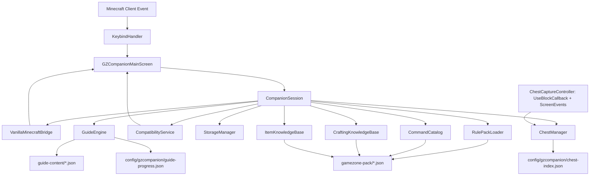

# GZ Companion Architecture Guide

## 1. High-Level Architectural Rule
> **"Java understands Minecraft. Data understands GameZone."**

The mod is architected to ensure that GameZone server mechanics, commands, recipes, and rules can evolve without requiring core mod rewrites or recompilations.

---

## 2. Layer & Package Separation

```
se.jimmyeliasson.gzcompanion
├── GZCompanionClient.java        # Fabric client entrypoint
├── core/
│   ├── CompanionConstants.java   # Mod metadata
│   ├── CompanionSession.java     # Runtime coordinator singleton
│   └── feature/                  # Data-driven feature flags
├── guide/
│   ├── GuideEngine.java          # Progression state & inference engine
│   ├── GuideLoader.java          # Resilient guide JSON parser
│   ├── GuideValidator.java       # Prerequisite cycle & schema validator
│   ├── bridge/                   # Player snapshot abstraction
│   ├── condition/                # Pure condition evaluators
│   ├── model/                    # Immutable guide definitions & records
│   └── progress/                 # Local progress storage & atomic file writes
├── chest/
│   ├── ChestManager.java         # "Last known contents" index & capture session state machine
│   ├── bridge/                   # MinecraftChestCaptureAdapter + ChestCaptureController (the ONLY
│   │                              # place touching Minecraft menu/block/screen classes)
│   ├── model/                    # StoredContainer, StorageKind, StorageShape, ChestTypeFilter,
│   │                              # ChestSortMode, StoragePosition (no MC types)
│   └── storage/                  # JsonChestIndexStore, ChestIndexLoadResult & chest-index.json schema
├── minecraft/
│   ├── MinecraftBridge.java      # Runtime abstraction interface
│   └── VanillaMinecraftBridge.java # Minecraft client API caller
├── profile/
│   ├── ServerProfile.java        # Server identity models
│   └── ServerDetection.java      # Safe hostname resolution
├── gamezone/
│   ├── RulePack.java             # In-memory rule pack model
│   ├── RulePackManifest.java     # Version & verification metadata
│   ├── RulePackLoader.java       # Resilient JSON parser
│   └── model/                    # Commands, guides, world rules
├── knowledge/                     # M4: GameZone command/crafting/item knowledge (see KNOWLEDGE-BASE.md)
│   ├── common/                   # VerificationStatus/Metadata, KnowledgeModuleStatus, KnowledgeLoadResult
│   ├── commands/                 # CommandCatalog, CommandKnowledgeLoader (commands.json)
│   ├── crafting/
│   │   ├── CraftingKnowledgeBase.java, CraftingKnowledgeLoader.java  # crafting-overrides.json
│   │   ├── ClientRecipeSnapshot.java  # runtime-observed, NEVER "Vanilla", no VerificationMetadata
│   │   └── bridge/MinecraftRecipeDisplayAdapter.java  # ONLY place touching MC recipe/item classes
│   ├── items/                    # ItemKnowledgeBase, ItemKnowledgeLoader (item-overrides.json - relics)
│   ├── settlement/                # M6: SettlementCatalog, SettlementKnowledgeLoader (see SETTLEMENT-COMPANION.md)
│   ├── building/                  # M7: BuildingKnowledgeBase, BuildingKnowledgeLoader (see BUILDING-PLANNER.md)
│   └── economy/                   # M9: MarketWatchInfo, MarketWatchKnowledgeLoader (see MARKETWATCH.md)
├── settlement/                    # M6: local settlement planner state (see SETTLEMENT-COMPANION.md)
│   ├── SettlementPlannerManager.java # Runtime coordinator, mirrors ChestManager's fail-closed pattern
│   └── storage/                  # JsonSettlementPlannerStore & settlement-planner.json schema
├── building/                      # M7: local building plan state (see BUILDING-PLANNER.md)
│   ├── BuildingPlanManager.java   # Runtime coordinator, mirrors SettlementPlannerManager
│   └── storage/                  # JsonBuildingPlanStore & building-plans.json schema
├── advisor/                       # M8: contextual "Vad ska jag göra?" advisor (see ADVISOR.md)
│   ├── AdvisorContext.java, AdvisorSuggestion.java  # plain data, no Minecraft types
│   ├── AdvisorEngine.java        # pure, deterministic rule evaluator
│   └── AdvisorContextBuilder.java # the ONLY class here touching CompanionSession
├── marketwatch/                   # M9: local MarketWatch watchlist state (see MARKETWATCH.md)
│   ├── MarketWatchNotesManager.java # Runtime coordinator, mirrors BuildingPlanManager
│   └── storage/                  # JsonMarketWatchNotesStore & marketwatch-notes.json schema
├── gamezone/events/, gamezone/parsing/, gamezone/toast/, gamezone/bridge/  # M5: read-only GameZone
│   │                              # event engine (see GAMEZONE-ADAPTER.md) - chat is only ever observed,
│   │                              # never cancelled/rewritten/answered
├── diagnostics/
│   ├── CompatibilityStatus.java  # Semantic status codes & colors
│   ├── ModuleReport.java         # Per-module diagnostic record
│   ├── CompatibilityResult.java  # Overall evaluation
│   └── CompatibilityService.java # Dynamic compatibility evaluator
├── storage/
│   ├── CompanionConfig.java      # Local user preferences
│   └── StorageManager.java       # Local JSON persistence & backup
├── keybind/
│   └── KeybindHandler.java       # Fabric KeyMapping registration
└── ui/
    ├── GZTheme.java              # Color palette, tokens, card renderer
    ├── TabType.java              # 9 navigation section definitions
    ├── GZCompanionMainScreen.java# Main container dialog screen
    ├── layout/                   # Responsive geometry & typography
    ├── TextInputHandler.java     # Shared focus/keyPressed/charTyped contract for tabs with a text input
    └── tabs/
        ├── HomeTabComponent.java # Home dashboard
        ├── GuideTabComponent.java# Interactive 2-pane guide tab
        ├── KistorTabComponent.java # Searchable 2-pane Chest Manager tab
        ├── CommandsTabComponent.java # Searchable Kommandon tab (implements TextInputHandler)
        ├── CraftingTabComponent.java # Crafting tab: recipes + GameZone items (implements TextInputHandler)
        ├── SettlementTabComponent.java # M6: Översikt/Progression/Material/Medlemmar (implements TextInputHandler)
        ├── BuildingsTabComponent.java # M7: search/detail + Structure Calculator + local plans (implements TextInputHandler)
        ├── MarketWatchTabComponent.java # M9: reference card + local notes watchlist (implements TextInputHandler)
        └── PlaceholderTabComponent.java # Placeholder sections
```

---

## 3. Data Flow



The Crafting tab additionally reads `MinecraftRecipeDisplayAdapter.readClientRecipeBook()` directly at
render time (via `LocalPlayer.getRecipeBook()`) — this is runtime-observed, client/server-synced data,
never routed through `CraftingKnowledgeBase` and never treated as a Rule Pack fact (no `VerificationMetadata`,
never labeled "Vanilla" — see [Knowledge Base](KNOWLEDGE-BASE.md)).

`ChestCaptureController` is the only place that registers Fabric client hooks for the Chest
Manager (`UseBlockCallback` for the physical block interaction, `ScreenEvents` for the opened
storage screen lifecycle). It translates real Minecraft state into plain domain calls on
`ChestManager` via `MinecraftChestCaptureAdapter` — no Minecraft menu/block/screen types leak
into `chest.model` or `chest.storage`. See [Chest Manager](CHEST-MANAGER.md) for the full capture
lifecycle and fair-play boundary.

---

## 4. Graceful Degradation Strategy
- If a specific Rule Pack module fails to parse or is missing from classpath, `RulePackLoader` records a warning and instantiates an empty fallback collection for that module.
- `CompatibilityService` flags that individual module with `UNVERIFIED` or `WARNING`, while keeping the rest of the mod fully operational.
- If `chest-index.json` cannot be read, `ChestManager` reports `ChestManagerStatus.ERROR`, the Kistor tab shows a controlled error state, and the rest of the mod (Guide, Home, etc.) remains fully operational.
- Each of the three M4 knowledge modules (`CommandCatalog`, `CraftingKnowledgeBase`, `ItemKnowledgeBase`) is loaded independently in its own try/catch in `CompanionSession.loadKnowledgeModules()` and reports its own `KnowledgeModuleStatus` (LOADED/UNAVAILABLE/ERROR/INCOMPATIBLE) — a malformed `item-overrides.json` never affects `commands.json`, `crafting-overrides.json`, Guide, or Kistor, and vice versa. `KnowledgeModuleStatus` is intentionally new and scoped to `knowledge.*`; it does not replace or merge with the already-approved `GuideLoadStatus`/`ChestManagerStatus`.
- The UI displays explicit status badges instead of failing silently or guessing server behavior.